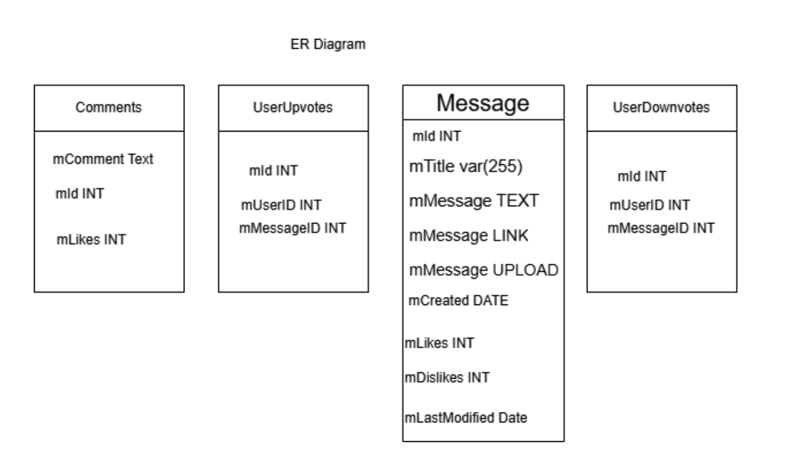
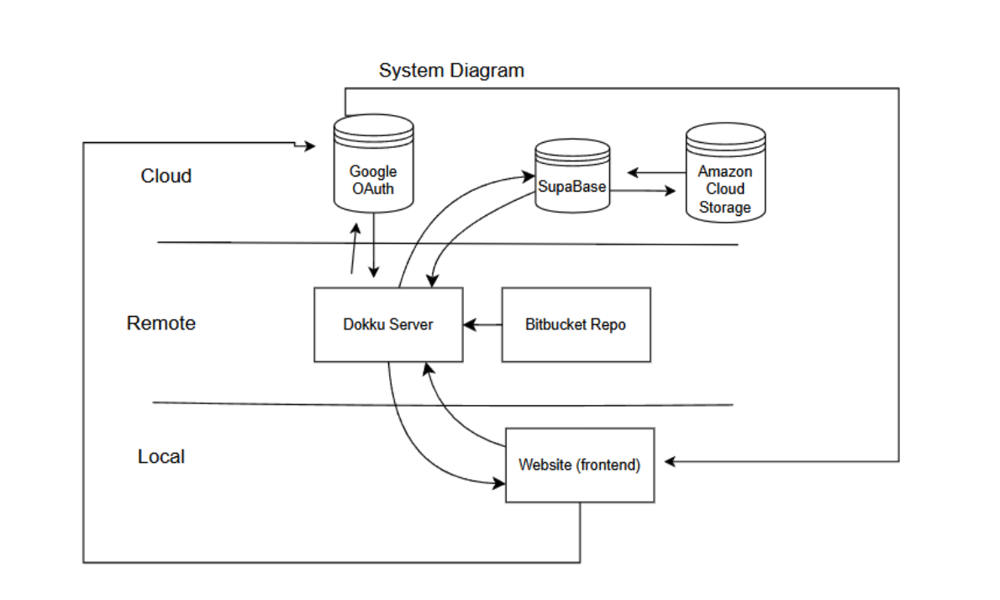
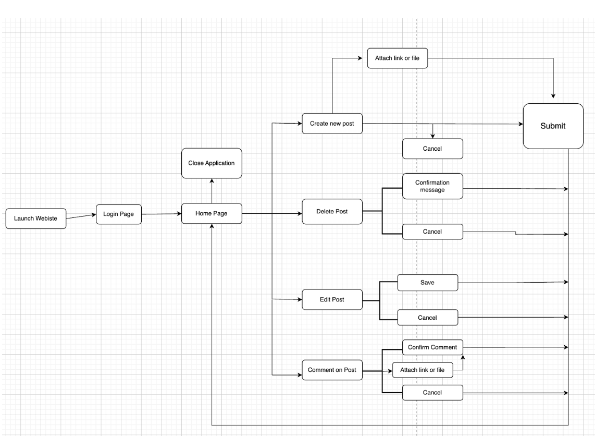
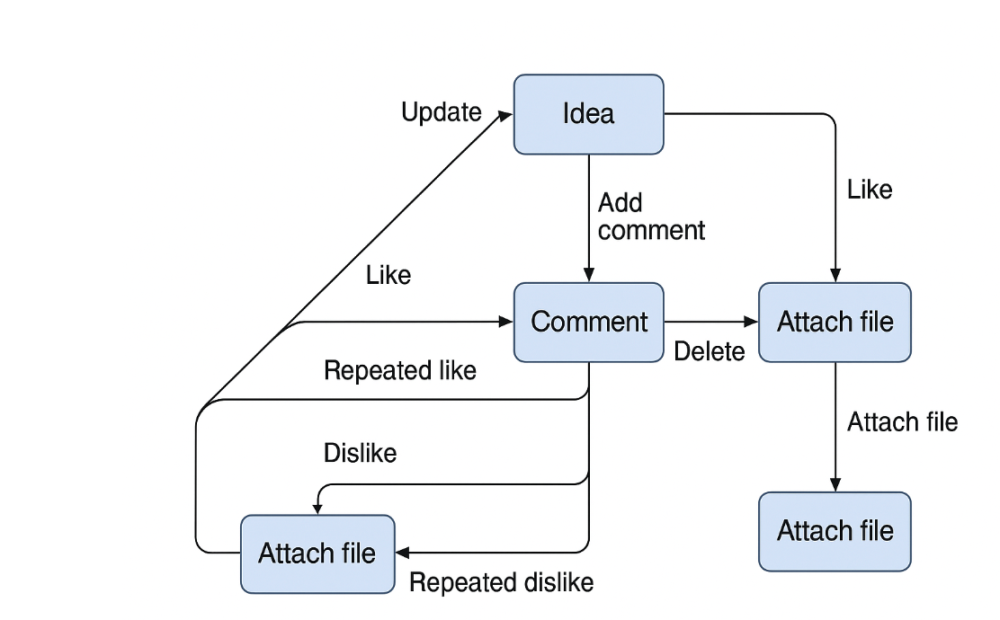
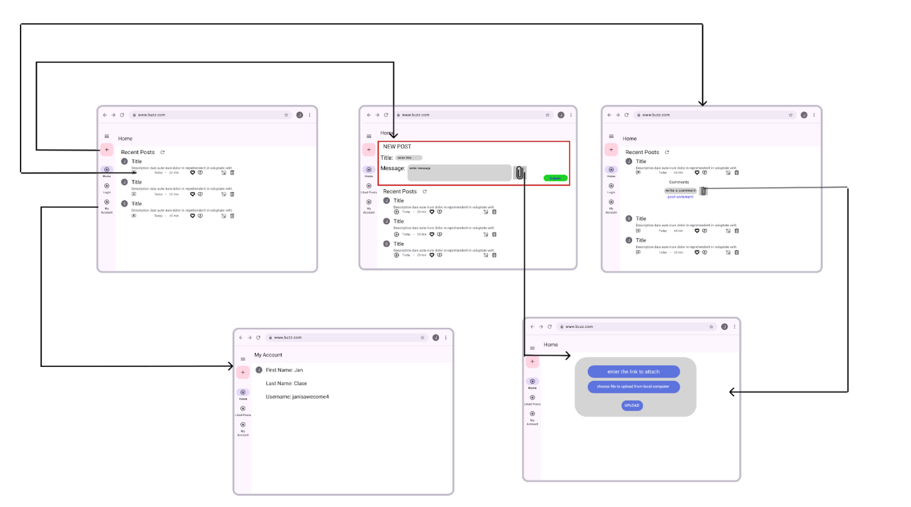

# CSE 216 Team Repo

## Details
- Semester: Spring 2025
- Team Number: 02
- Team Name: team02
- Team Members: 

Serkan Bayrak (FRONT END), sbb227@lehigh.edu
Jan Clase (BACK END), jlc226@lehigh.edu
Ben Hoody(ADMIN), beh427@lehigh.edu
Antony Tomy (PM), ant823@lehigh.edu

- Bitbucket Repository: https://bitbucket.org/ews2111/cse216_sp25_team_02
- Jira Board: https://cse216-25sp-beh427.atlassian.net/jira/software/projects/TL96/boards/2?assignee=712020%3Aed3d8bd6-f73f-4ff3-a05d-99ae90c4c56e
- Backend URL: team-02.dokku.cse.lehigh.edu

Phase 3 Sprint Description:

### ER Diagram

### Systems Diagram

### State Machine

### Idea State Machine

### UI Design

Description of phase:
In Phase 3, The Buzz is updated to let users attach files and links to ideas and comments using Google Drive or Cloud Storage. To make the app faster and easier to scale, session data is moved to Memcachier, and files are cached. The backend must still work with old data, and admins get better tools to manage uploads and remove outdated content.
